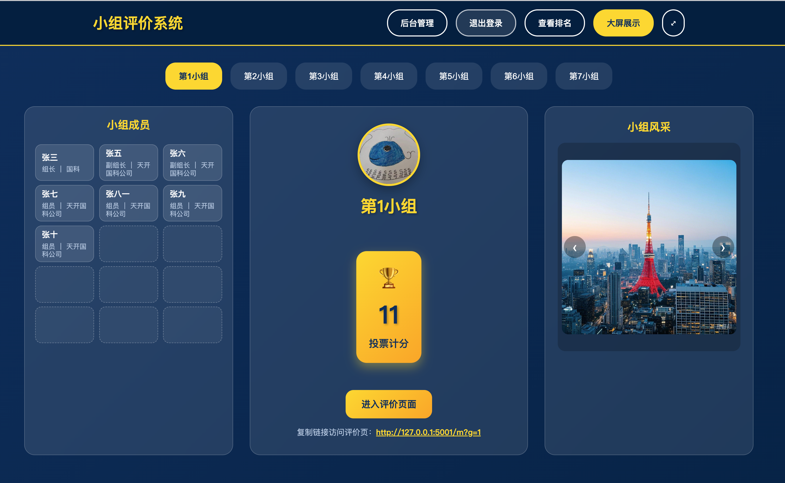
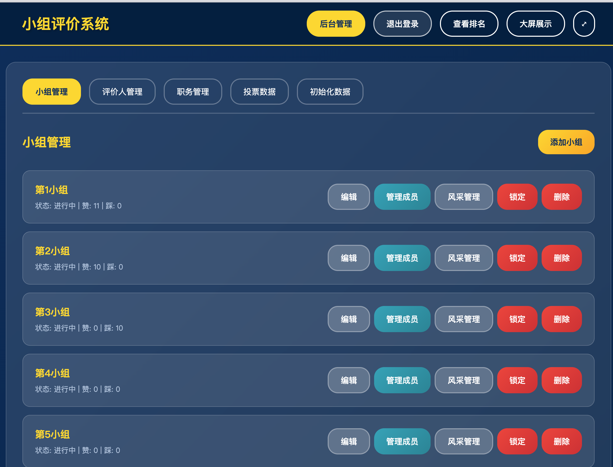
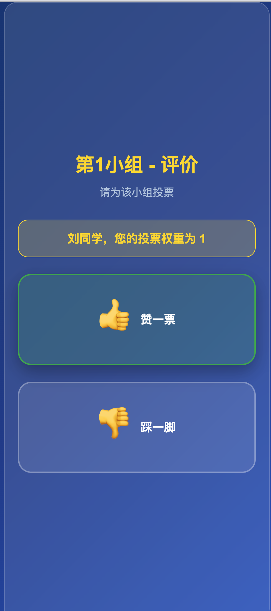
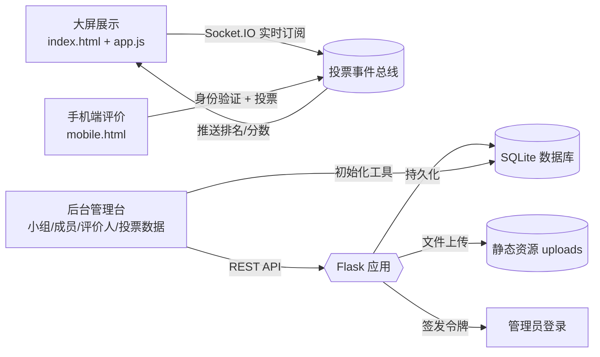

# 小组评价系统

一个完整的小组评价系统，支持大屏展示、手机端评价、后台管理和实时排名功能。

> 📢 **重要说明**：本文档于 v1.1.0 版本（2025-09-26）更新，补充了页面示意、功能结构图、许可证及更准确的部署指南。

## 功能特性

### 🎯 核心功能
- **大屏展示**：实时显示小组信息、成员列表、投票统计和风采轮播，支持全屏展示及组别快速切换
- **手机端评价**：扫码或分享链接进入移动端页面，完成身份校验后投票
- **后台管理**：提供小组、成员、评价人、职务、投票数据与初始化工具的全套管理能力
- **排名舞台**：内置领奖台式排名页面，自动同步实时成绩
- **实时通信**：通过 Socket.IO 推送投票更新，所有页面即时刷新数据

### 🎨 界面特色
- 深蓝色主题配色，专业美观
- 响应式设计，支持桌面与移动设备
- 流畅的动画效果和交互体验
- 二维码扫码评价，操作简便

### 🔧 技术栈
- **后端**：Python Flask + Flask-SocketIO + SQLite
- **前端**：HTML5 + CSS3 + 原生 JavaScript + Socket.IO
- **实时通信**：Socket.IO（WebSocket + 轮询回退）
- **数据存储**：SQLite（轻量级，无需额外安装）

## 系统页面速览

> 以下为关键页面示意图，帮助快速了解系统布局和核心交互。

| 页面 | 示意图 | 说明 |
| --- | --- | --- |
| 大屏展示 |  | 展示小组成员、实时成绩、二维码入口和风采轮播。 |
| 后台管理 |  | 维护小组、成员、评价人、职务与投票数据，并提供初始化工具。 |
| 手机端评价 |  | 扫码登录后进行身份验证，快捷完成赞成/反对投票。 |

## 快速开始

### 系统要求
- macOS 或 Linux 系统
- Python 3.7+
- 现代浏览器 (Chrome, Safari, Firefox)

### 安装和启动

1. **克隆项目**
   ```bash
   git clone <repository-url>
   cd evaluation-system
   ```

2. **一键启动**
   ```bash
   ./start.sh
   ```

3. **访问系统**
   - 服务默认运行在 `http://localhost:5001`
   - 大屏展示：`http://localhost:5001`
   - 排名舞台：页面顶部点击「查看排名」
   - 后台管理：页面顶部点击「后台管理」，默认账号 `super / tiandatiankai2025`
   - 如需临时修改管理员密码，可在启动时使用 `python src/main.py --pwd <新密码>` 或设置环境变量 `EVALUATION_ADMIN_PASSWORD`

### 初始化数据

首次使用时，建议先初始化示例数据：

1. 访问系统后，点击"后台管理"
2. 切换到"初始化数据"标签
3. 点击"初始化示例数据"按钮

这将创建：
- 示例小组、成员与风采照片
- 默认职务（组长、副组长、组员、技术负责人、产品经理）
- 示例评价人（包含老师和同学，权重不同）

## 使用指南

### 1. 后台管理

#### 小组管理
- 添加/编辑/删除小组
- 设置小组名称和Logo
- 上传小组风采照片
- 管理小组成员和职务
- 锁定/解锁小组评价状态

#### 评价人管理
- 添加可参与评价的人员
- 设置姓名、手机号和投票权重
- 老师权重建议设为10，同学设为1

#### 职务管理
- 管理小组成员可选择的职务
- 支持自定义职务名称

### 2. 大屏展示

- **小组切换**：顶部按钮可切换不同小组
- **成员信息**：左侧显示当前小组成员列表
- **投票统计**：中央实时显示加权总分及投票明细
- **二维码**：扫码进入手机端评价页面
- **照片轮播**：右侧展示小组风采照片

### 3. 手机端评价

1. **扫码进入**: 用手机扫描大屏上的二维码
2. **身份验证**: 输入姓名和手机号进行验证
3. **投票评价**: 选择"赞一票"或"踩一脚"
4. **实时更新**: 投票后大屏幕立即显示最新统计

### 4. 排名查看

- 点击「查看排名」查看所有小组的实时排名
- 采用奥运领奖台布局，第一名居中最高
- 前三名显示金银铜皇冠标识
- 支持刷新后保留最新统计数据

## 功能结构图



## 数据库设计

### 主要数据表
- **groups**：小组信息表
- **members**：小组成员表
- **roles**：职务表
- **voters**：评价人表
- **votes**：投票记录表（含权重与时间）
- **group_photos**：小组风采照片表

### 关键特性
- 支持评价人权重设置
- 防止重复投票
- 小组评价状态锁定
- 实时投票统计
- 上传风采照片并轮播展示

## API接口

### 小组管理
- `GET /api/groups` - 获取所有小组
- `POST /api/groups` - 创建小组（需管理员令牌）
- `PUT /api/groups/<id>` - 更新小组（需管理员令牌）
- `DELETE /api/groups/<id>` - 删除小组（需管理员令牌）
- `POST /api/groups/<id>/lock` - 锁定/解锁小组（需管理员令牌）

### 投票相关
- `POST /api/verify-voter` - 验证评价人身份
- `POST /api/vote` - 提交投票（包含权重计分）
- `GET /api/groups/<id>/stats` - 获取小组投票统计
- `GET /api/ranking` - 获取排名

### 其他接口
- 成员管理、职务管理、评价人管理等

## 部署说明

### Docker 镜像
支持通过 Docker 将系统打包并运行，数据库与上传文件均可通过挂载卷的方式持久化到宿主机。

1. **构建镜像**
   ```bash
   docker build -t evaluation-system:latest .
   ```

2. **准备持久化目录**（位于项目根目录外部亦可）
   ```bash
   mkdir -p data/uploads data/database
   ```

3. **启动容器**
   ```bash
   docker run -d \
     --name evaluation-system \
     -p 5001:5001 \
     -v $(pwd)/data/uploads:/app/backend/src/static/uploads \
     -v $(pwd)/data/database:/app/backend/src/database \
     -e EVALUATION_ADMIN_PASSWORD=你的管理员密码 \
     evaluation-system:latest
   ```

   - `-v` 选项会将上传文件 (`src/static/uploads`) 与数据库 (`src/database/app.db`) 映射到宿主机 `data` 目录。
   - 容器会以 `python src/main.py --pwd=$EVALUATION_ADMIN_PASSWORD` 启动，确保管理员密码在启动时写入配置。
   - 如需查看启动日志，可执行 `docker logs -f evaluation-system`。
   - 停止容器：`docker stop evaluation-system`，重新启动：`docker start evaluation-system`。

### 开发环境
项目已配置为开发模式，支持热重载和调试。可通过 `python src/main.py --pwd <新密码>` 在启动时临时覆盖管理员密码。

### 生产环境
如需部署到生产环境，建议：
1. 修改Flask配置，关闭调试模式
2. 使用Gunicorn等WSGI服务器
3. 配置Nginx反向代理
4. 使用PostgreSQL或MySQL替代SQLite

## 故障排除

### 常见问题

1. **启动失败**
   - 检查Python版本是否为3.7+
   - 确保虚拟环境正确激活
   - 检查端口5001是否被占用

2. **二维码无法扫描**
   - 确保手机和电脑在同一网络
   - 检查防火墙设置
   - 尝试使用IP地址访问

3. **投票不成功**
   - 检查评价人信息是否正确录入
   - 确认小组状态未被锁定
   - 检查是否已经投过票

4. **照片无法显示**
   - 检查图片文件路径是否正确
   - 确认uploads目录权限
   - 支持的图片格式：PNG, JPG, JPEG, GIF

## 技术支持

如遇到问题，请检查：
1. 浏览器控制台错误信息
2. 服务器终端日志输出（含 Socket.IO 连接日志）
3. 网络连接状态及端口映射

## 开源许可

本项目自 v1.1.0 起采用 **Creative Commons Attribution-ShareAlike 4.0 International (CC BY-SA 4.0)** 许可证：

- ✅ 允许复制、分发、演示及商业使用；
- ✅ 允许在同一许可下发布修改版或增强功能，并欢迎合并回本项目；
- ✅ 必须保留原始署名、许可证链接及不可修改的来源信息；
- ⚠️ 若发布基于本项目的二次创作，需同样以 CC BY-SA 4.0 协议公开；
- ⚠️ 使用者须明确标注来源并说明修改内容（如有）。

详见 [LICENSE](LICENSE) 文件获取完整条款。

## 更新日志

### v1.1.0 (2025-09-26)
- 新增系统页面示意图与功能结构图，帮助快速理解交互流程
- 调整文档内容，修正端口、路径及权限说明并补充管理员账号信息
- 引入 CC BY-SA 4.0 许可证，明确开源与商业使用要求
- 更新数据库与 API 章节，覆盖最新数据表与权限约束

### v1.0.0 (2024-12-22)
- 初始版本发布
- 完整的评价系统功能
- 支持大屏展示和手机端评价
- 实时 WebSocket 通信
- 后台管理功能

